# STM32F103RCT6 硬件移植与调试报告

## 1. 项目目标

在 STM32F429 开发板版本完成阶段 1~8 后，自主完成一块 STM32F103RCT6 专用 PCB，并按“单项外设验证 -> 完整项目移植 -> 系统验收”的顺序验证软硬件闭环。

本阶段不是简单更换 MCU，而是对原理图、PCB、焊接、供电、通信接口、存储器、文件系统、RTOS 资源和整机稳定性进行完整验证。

## 2. PCB 迭代

| 裸板 | 未成功的初版焊接 |
| --- | --- |
| 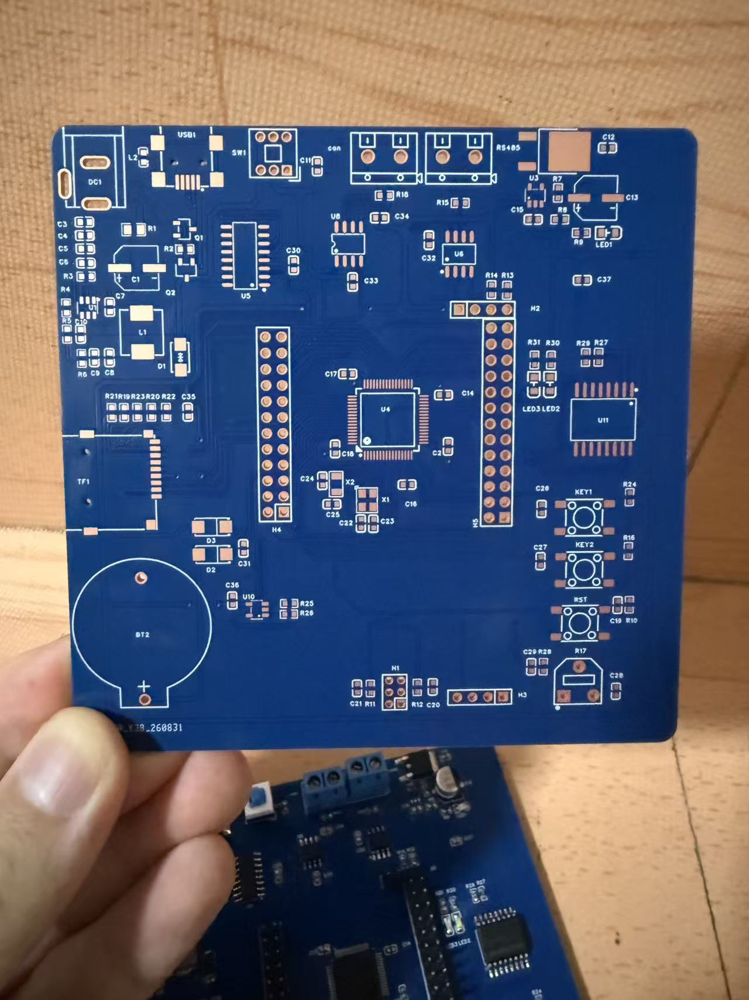 | 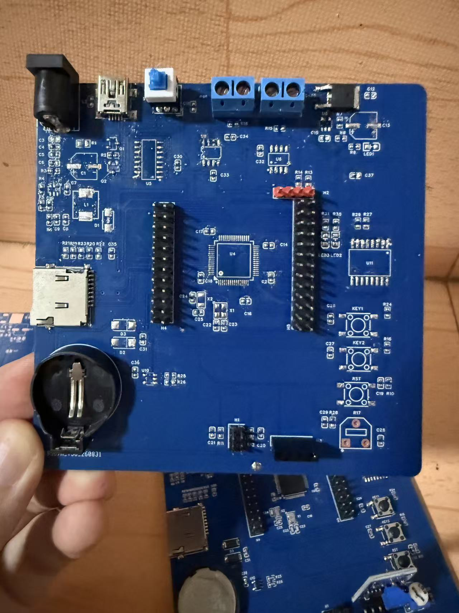 |

| 最终成品 | 三版对比 |
| --- | --- |
| 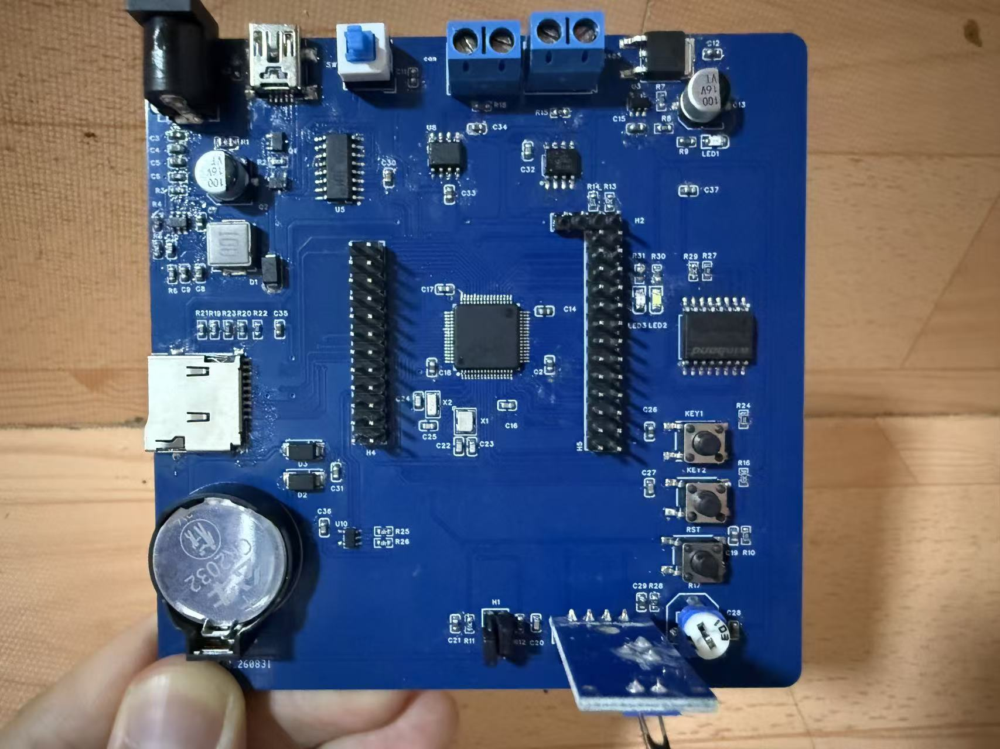 | 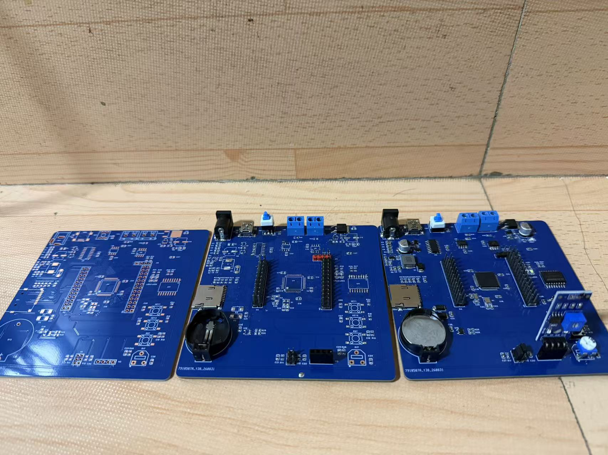 |

完整联调接线：

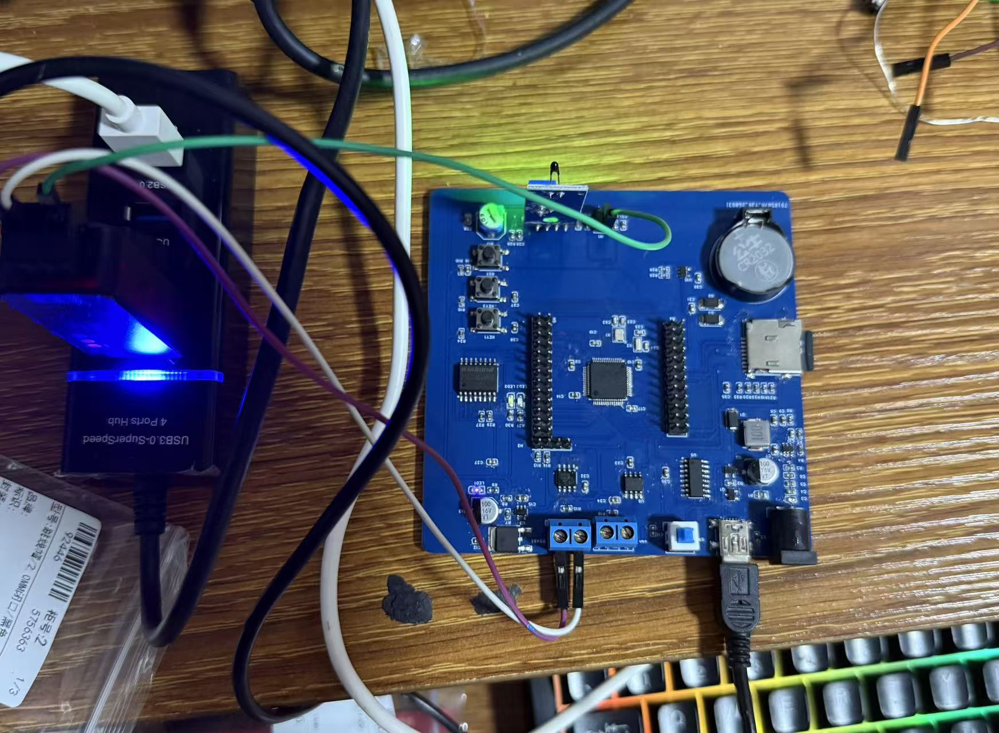

## 3. 硬件设计

PCB 布局：

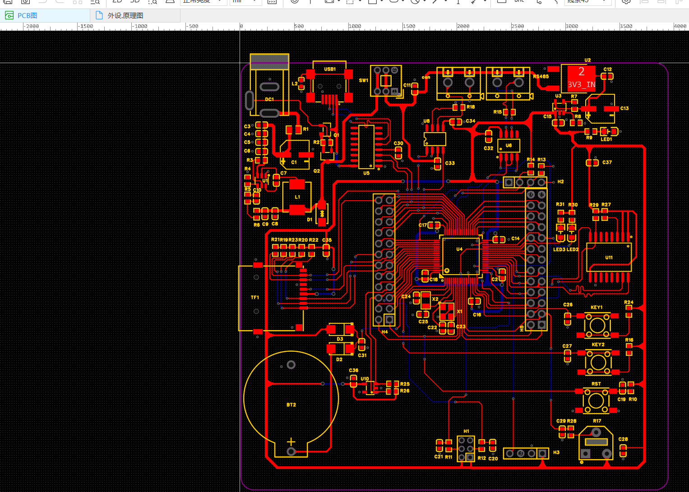

原理图按功能分为电源、MCU 最小系统和外围接口三部分：

| 电源 | MCU 最小系统 | 外围接口 |
| --- | --- | --- |
| 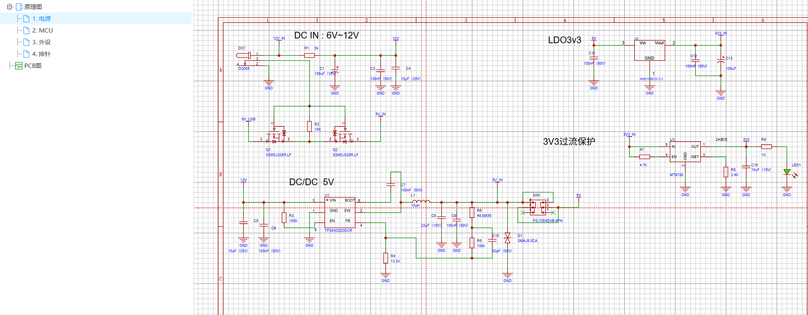 | 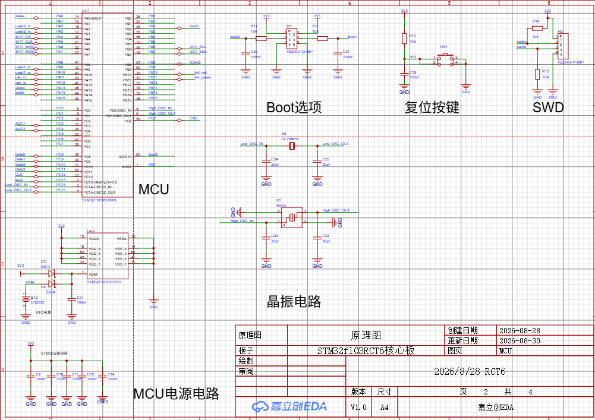 | 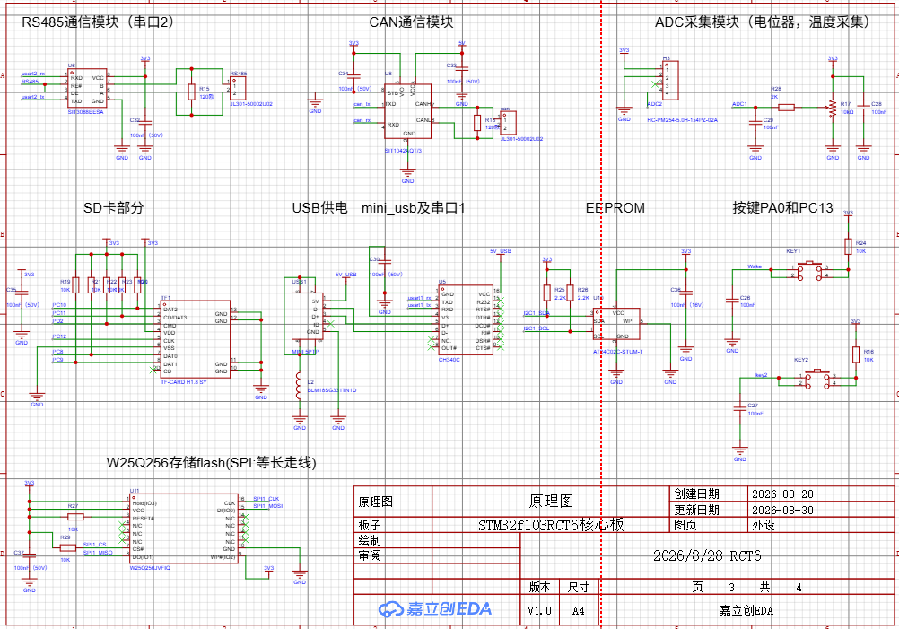 |

板载并完成单项验证的资源包括：

- STM32F103RCT6、SWD、BOOT、复位、LED 和按键
- USART1 调试串口、USART2 + RS485
- CAN 收发器与 CAN 总线接口
- 两路 ADC DMA：电位器与 NTC
- SPI W25Q256 NOR Flash
- I2C AT24C02C EEPROM
- SDIO 4-bit SD 卡与 FatFs
- RTC 和 VBAT 纽扣电池后备供电

## 4. 单项外设调试结果

| 模块 | 验证内容 | 结果 |
| --- | --- | --- |
| LED / 按键 | GPIO 输入输出与按键触发 | 通过 |
| USART1 | DMA、中断、串口收发和 `printf` | 通过 |
| RS485 | USART2 半双工收发、DE/RE 控制 | 通过 |
| CAN | 1 Mbps、扩展帧 `0x1314`、双向收发 | 通过 |
| 双 ADC | PC3/PC4 扫描、DMA 循环采样、工程量和温度换算 | 通过 |
| W25Q256 | JEDEC ID `EF 40 19`、擦除、跨页 DMA 写入与回读 | 通过 |
| AT24C02C | 设备探测、8 字节自动分页、DMA 写入与断电保持 | 通过 |
| SD 卡 | SDIO 4-bit 12 MHz DMA、FatFs 挂载、文件写入和回读 | 通过 |
| RTC / VBAT | 秒计时、+30 秒闹钟、主电源断开后继续走时 | 通过 |

SDIO 调试时先以 1-bit 模式确认基础链路，再将 4-bit 轮询速度降至 3 MHz 定位时序，最终完成 4-bit 12 MHz DMA 模式验证。

## 5. 完整项目移植

完整工程位于 `RCT6硬件测试/RCT6项目代码`。移植后保留了原 F429 项目的协议与任务分层，并按 RCT6 的引脚和资源重新适配 BSP。

主要功能：

- FreeRTOS 四任务：Modbus、Monitor、Acquire、Log
- USART2 `9600、8E1`，从站地址 `1`
- Modbus `0x03 / 0x04 / 0x06 / 0x10`、异常响应和广播写入
- 双 ADC DMA 采集、电位器工程量和 NTC 温度换算
- W25Q256 A/B 双槽配置持久化、CRC16 校验和掉电恢复
- RTC 时间戳、SDIO DMA + FatFs `measure.csv` 异步追加日志
- 任务心跳、健康寄存器和 IWDG

RCT6 工程内存参数由旧工程遗留的 C8T6 配置修正为 Flash 256 KB、SRAM 48 KB。

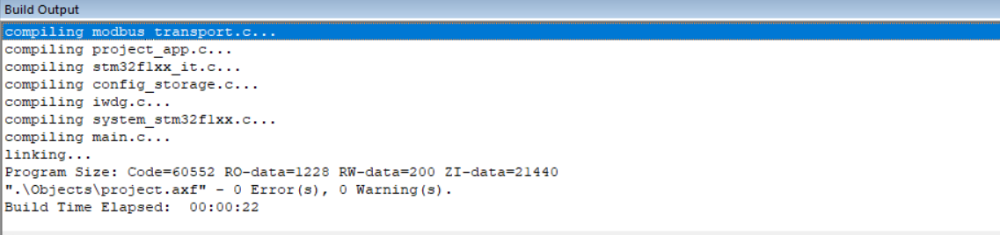

最终 Keil MDK-ARM 编译结果：

```text
Code=60552  RO-data=1228  RW-data=200  ZI-data=21440
0 Error(s), 0 Warning(s)
```

## 6. 整机验收

### 6.1 系统启动与采集

上电后 FatFs 挂载和 W25Q256 配置存储通过，FreeRTOS 四任务启动，双 ADC 持续输出原始值、工程量、温度和报警状态。

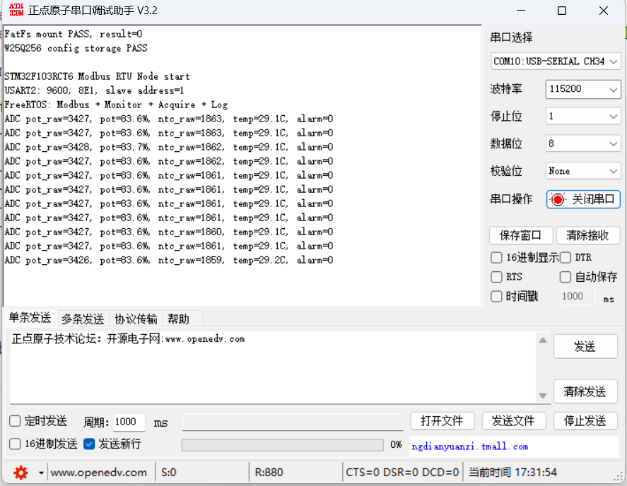

### 6.2 Modbus 数据与运行时配置

输入寄存器可正确读出采样数据、状态计数和健康标志。

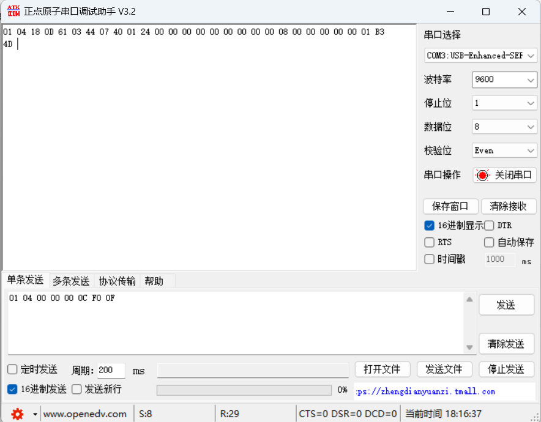

运行期间批量修改温度上下限后，报警状态可在 `0 / 1 / 2` 之间正确切换，无需重启。

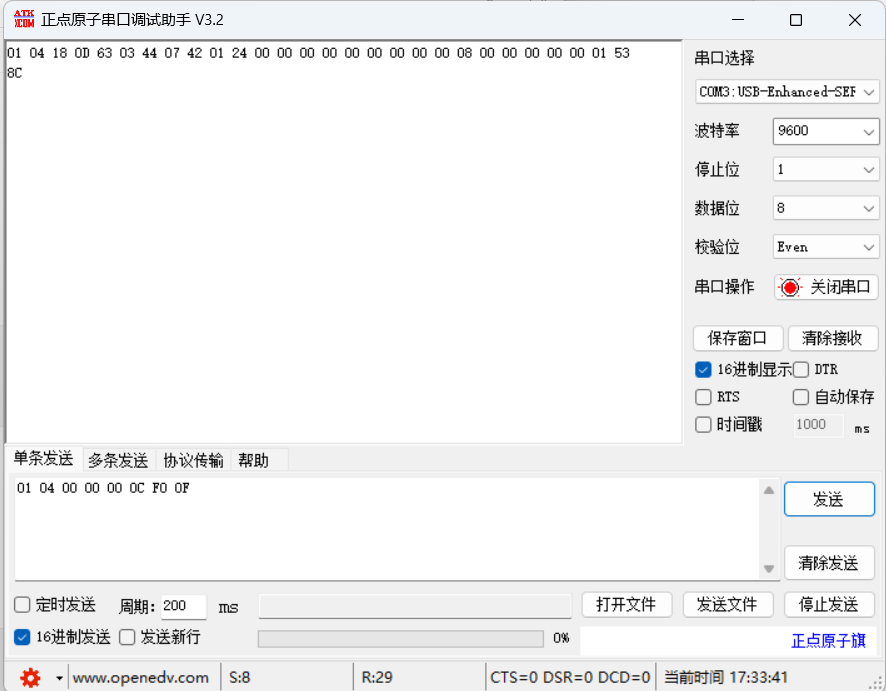

### 6.3 SD 日志与 Flash 掉电保持

`measure.csv` 按秒记录日期、时间、ADC 原始值、工程量、温度和报警状态；复位后继续追加，取卡后可在电脑端正常读取。

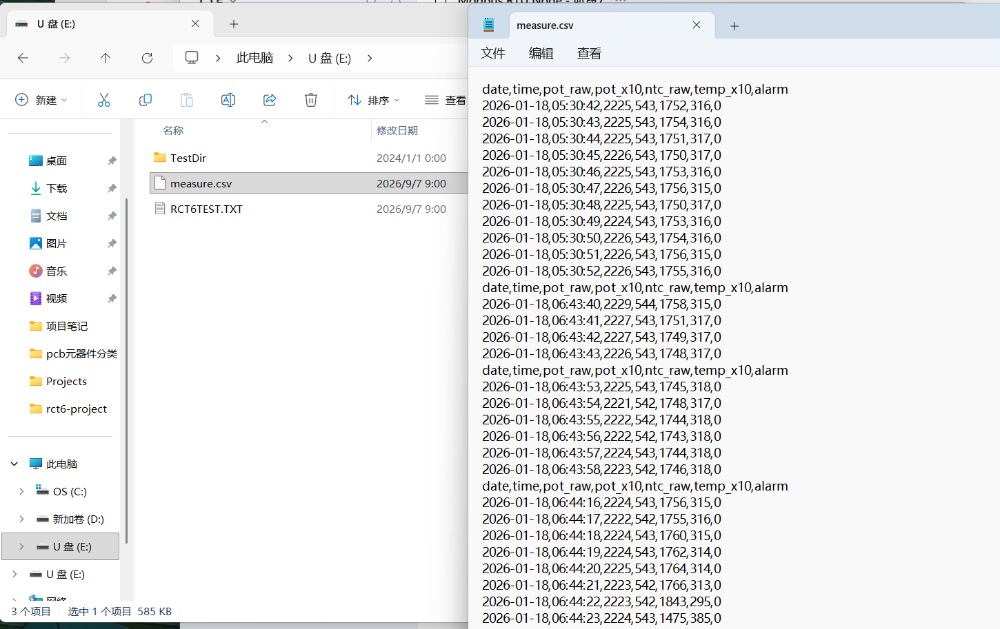

保持寄存器写入 W25Q256 后，断电重新上电仍能恢复配置。

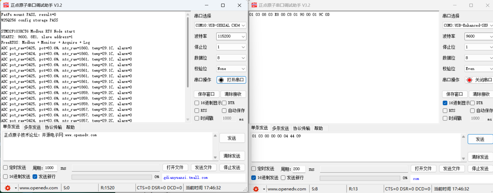

### 6.4 协议异常处理

非法参数返回 Modbus 异常码 `03`：

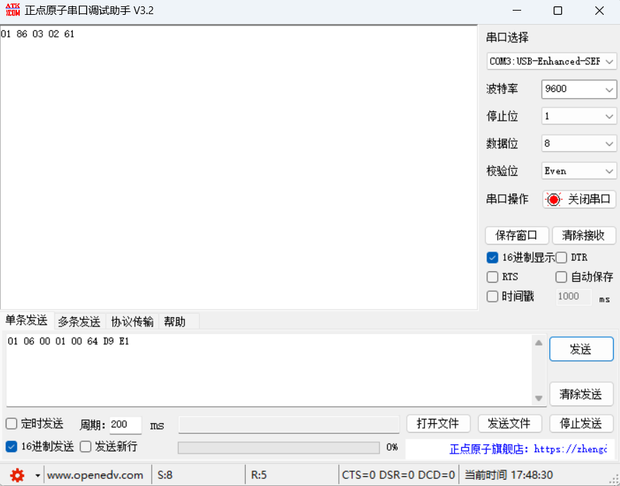

非法地址返回 Modbus 异常码 `02`：

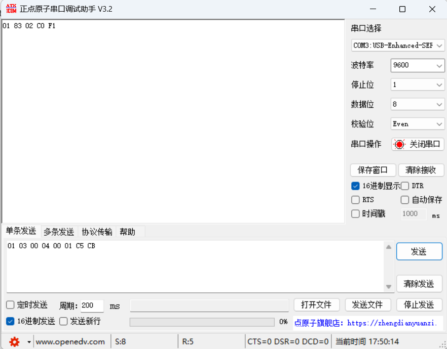

同时验证了非法功能码返回异常码 `01`、错误 CRC 不响应、广播写入执行但不响应。

### 6.5 压力测试

连续 5 分钟自动读取 12 个输入寄存器，停止自动发送后再次手动读取，设备仍立即返回正确数据。统计结果：

```text
接收帧数：1521
帧头错误：0
CRC 错误：0
健康故障：0
日志错误：0
当前健康状态：1
```

测试后 USART1 仍持续打印 ADC，`measure.csv` 仍按秒追加，证明通信、采集和日志任务可并发稳定运行。

## 7. 调试问题与复盘

本次从焊接到整机运行遇到的主要问题：

1. 首版 PCB 没有完整丝印，增加了焊接方向判断和调试成本。
2. 初期一次焊接过多模块，没有坚持“焊一个、测一个”，导致供电故障定位范围过大。
3. 排针没有方便地引出 3V3/5V 和 GND，连接 RS485、CAN 和测量电源不够方便。
4. 首次 MCU 焊接后 3V3 被拉低到约 2.7 V，降压区域严重发热；拆除 MCU 后短路消失，更换并重新焊接后恢复。
5. CAN_H 与 CAN_L 一度接反，交换后上位机正常收发。
6. RS485/CAN 区域焊接后曾出现供电异常，拆换器件并检查焊点后恢复。
7. USB 接口漏焊电容，且有两个引脚轻微虚焊，造成 Windows 无法稳定识别 CH340。
8. SD 卡 4-bit 高速模式最初挂载失败，通过分阶段降低总线复杂度定位，最终 4-bit 12 MHz DMA 通过。
9. AT24C02C DMA 跨页写入首次失败，修正分页发送完成判定后通过，并验证断电保持。
10. 部分串口工具在偶校验模式下会把高位字节显示成 `3F`，更换正确的十六进制收发设置后恢复。
11. 压力测试期间 USART1 一度停止显示，拔插 CH340 USB 后恢复；Modbus、ADC、SD 日志始终运行，定位为 USB/CH340/Windows 接收链路问题。

后续画板应在投板前完成丝印和接口检查，并严格采用“电源 -> MCU 最小系统 -> 单个外设 -> 整机”的分模块焊接测试顺序。

## 8. 已知限制

- RTC 首次使用默认日期和时间，当前没有通过 Modbus 或上位机同步电脑时间。
- IWDG 已由 MonitorTask 在健康状态下正常喂狗，但 RCT6 整机版本尚未单独执行停止喂狗的故障注入测试。
- CAN 和 EEPROM 已通过单项硬件测试，当前 Modbus 数据采集应用没有将它们纳入四任务业务流程。

## 9. 结论

自制 STM32F103RCT6 板已完成从 PCB 设计、焊接排障、单项外设验证到 FreeRTOS 项目整机运行的完整闭环。阶段 1~8 的核心功能在资源更小的 RCT6 上正常运行，编译无错误和警告，协议、采集、存储、日志与健康监控通过实机验收。
